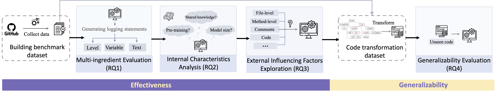

# LogStudy
LogBench is the benchmark for evaluating the performance of LLMs in logging statement generation.
Here is the overview of the study:

# Download the Datasets
As GitHub does not hold large datasets, you can download the benchmark dataset LogBench-O at [here](https://drive.google.com/file/d/1KS4xrHkzggbmorK9OwGmTLa7QYmRsDGQ/view?usp=share_link)

# Study Objects
| Model        | Access | Year |
| ------------ | ------ | ---- |
| Davinci      | API    | 2022 |
| ChatGPT      | API    | 2022 |
| LANCE        | Model  | 2022 |
| InCoder      | Model  | 2022 |
| CodeGeex     | Plugin | 2022 |
| TabNine      | Plugin | 2022 |
| Copilot      | Plugin | 2021 |
| Code Whisper | Plugin | 2022 |

# Benchmark Details
## Task Definition
## LogBench-O
## LogBench-T

# Example Results of each Baseline
The folder `/examples` contains the sampled outputs of each baseline.

# Code Transformation Tool
The folder `/src` includes source code.

The folder `/build` contains the built tranformation tool.
